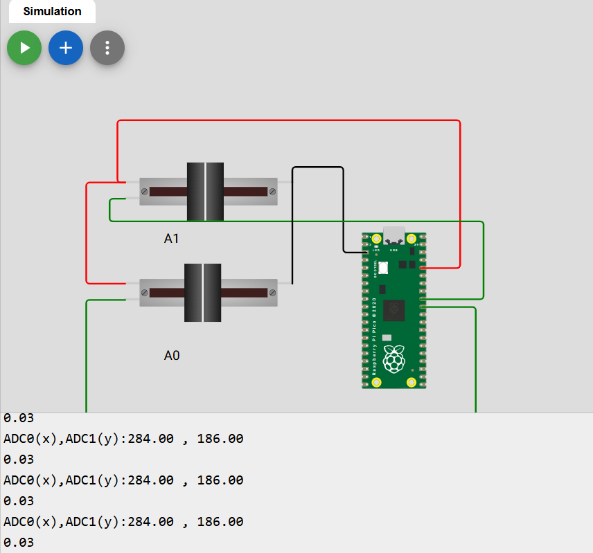

# TINYML-PICO
Autor: Ing. Moises Meza
---

Este repositorio busca presentar plantillas para trabajar con TinyML desde código puro tanto a nivel de generación del modelo con TensorFlow, luego generando el modelo ```.h``` para ser usado por algún arduino con soporte como la Raspberry pi pico. Este proyecto recomienda que tengas instalado ```uv``` para facilitar el instalado de las librerias de python (SOLO SI QUIERES CORRER EN LOCAL). Todo el proyecto puede funcionar desde Colab.

Los códigos para trabajar de forma local estan en el folder 
📂 [CODIGOS_TENSORFLOW](https://github.com/MSMRo/TINYML-PICO2-SIGNALS/tree/main/CODIGOS_TENSORFLOW)

Un poco de teoría: 
[LINK DE DIAPOSITIVA](https://drive.google.com/file/d/1DI_Uv3K8vGp_aNSIkcu0mj_IJ_fYKn9e/view?usp=sharing)


## **Librerias de Arduino:**

Las librerias usadas para trabajar con TinyML y Arduino son:
- Arduino_TensorflowLite [Descargar](https://raw.githubusercontent.com/MSMRo/TINYML-PICO2-SIGNALS/main/LIBRERIAS_ARDUINO_TINYML/ArduTFLite-main.zip)
- ArduTFLite [Descargar](https://raw.githubusercontent.com/MSMRo/TINYML-PICO2-SIGNALS/main/LIBRERIAS_ARDUINO_TINYML/Chirale_TensorFlowLite-main.zip)
- Chirale_TensorflowLite [Descargar](https://raw.githubusercontent.com/MSMRo/TINYML-PICO2-SIGNALS/main/LIBRERIAS_ARDUINO_TINYML/ArduTFLite-main.zip)

En este Notebook, se trabaja con Arduino-cli para programar el raspberry pi pico desde Google Colab, a modo de facilitar la compilación de los modelos usando los recursos de google.
Notebooks en colab:

- Creación del modelo [LINK NOTEBOOK TENSORFLOW](https://colab.research.google.com/drive/1v5MyUY8FHqm7rpP6NtgZ-m6fqvky_qV9?usp=sharing)
- Compilación en arduino [LINK NOTEBOOK ARDUINO](https://colab.research.google.com/drive/18JqPjP2GXr5BaOb8yWzYkTlMPOUE4xZr?usp=sharing)


## Testing en WOKWI:
Estas son las plantillas para trabajar con la prueba de los modelos inferidos en Raspberry pi pico en WOKWI:

- Plantilla solo RPI PICO [LINK](https://wokwi.com/projects/new/pi-pico)
- Plantilla 2 potenciometros [LINK](https://wokwi.com/projects/467953913992595457)



## Link ÚTILES
- https://www.hackster.io/moisesstevend/simulate-your-tinyml-projects-d8a904
- https://tinymldoc.streamlit.app/
- https://medium.com/@thommaskevin/tinyml-post-training-pruning-3c20a3053e80
- https://docs.arduino.cc/tutorials/nano-33-ble-sense/get-started-with-machine-learning/
- https://docs.edgeimpulse.com/tools/libraries/sdks/studio/python
